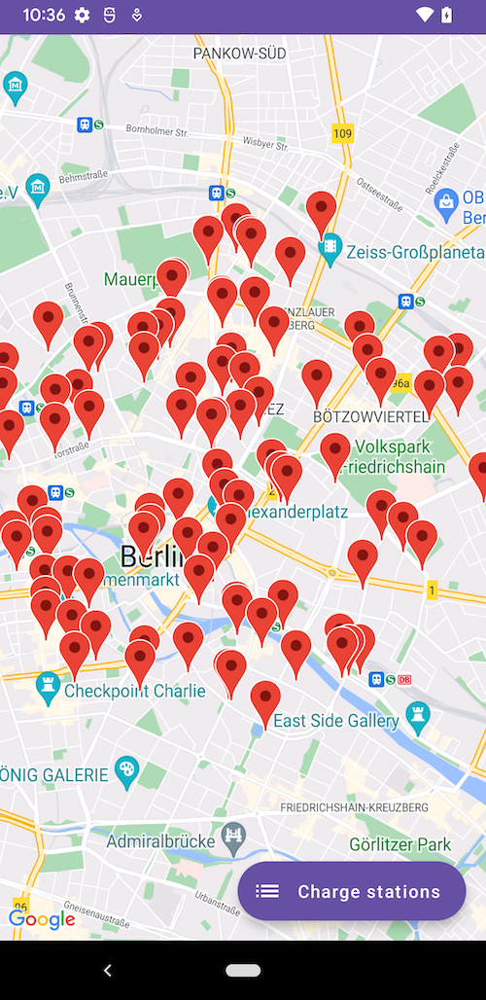
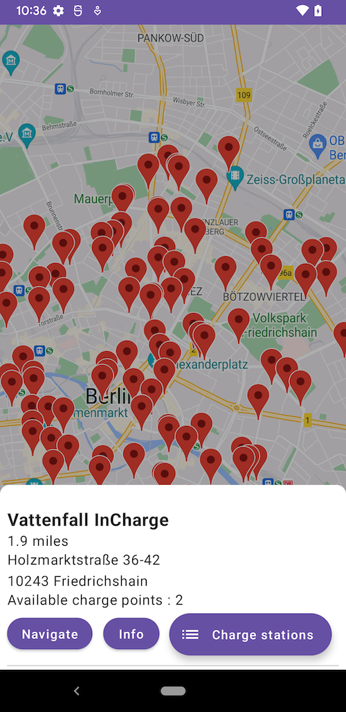
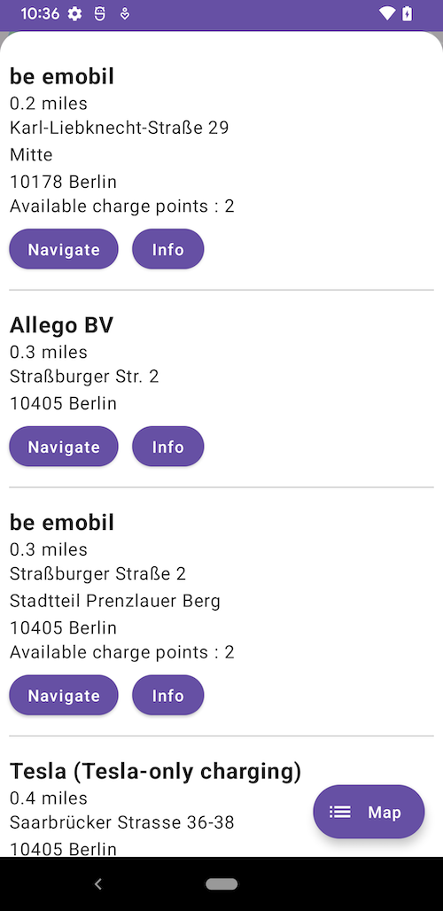
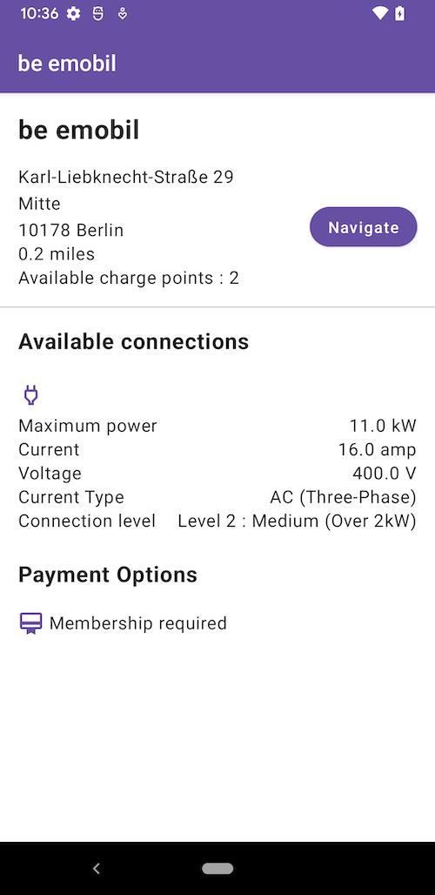
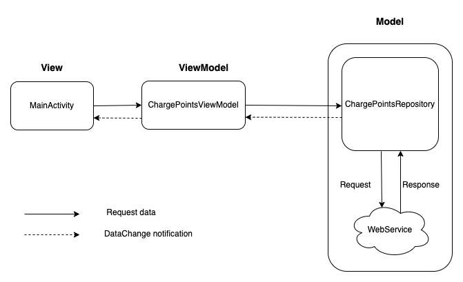
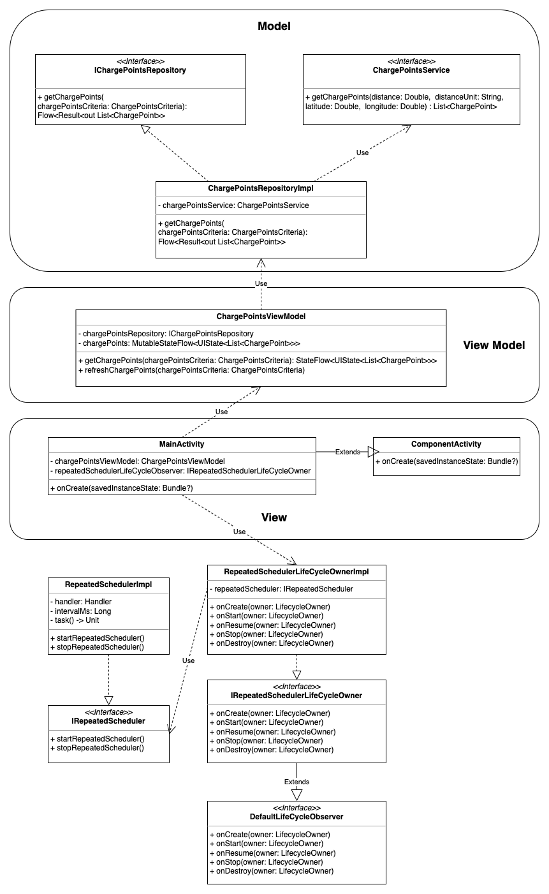

# Charge Stations app
## Setting up the project
Project requires Open Charge Map API and Google Maps API key for building. They are not hard coded in the project for security reasons. These values needs to provided in the local.properties file at the root of the project (parallel to app folder). Following are the key names in the local.properties. Provide in these while setting up the project before building.
```
MAPS_API_KEY=Your_Maps_Key
OCM_API_KEY=Your_OCM_Key
```

**Note:** Using local.properties does not offer security as the decompiled apk would have the API keys exposed. Idealy, Google Maps API needs to be protected by package name and signature in the Google Cloud Developer console and Open Charge Map API needs to be stored and fetched from Secret Manager services like Firebase services. For simplicity, I have used the local.properties. In production, this should be avoided.

## Screenshots








## Goals
1. Fetch the charging stations using the APIs available from 
	```
    https://openchargemap.org/site/develop/api
    ```
2. Show the obtained charging stations as markers in the Maps view.
3. On clicking a charging station, show the details of the charging station.
4. Update the list of charge stations every 30 seconds.

## Implementation Goals
1. Implement Model-View-ViewModel architecture
2. Use modern reactive APIs
3. Use dependency injection
4. Use Jetpack Compose for the UI
5. Update the list of charge station in lifecycle-aware approach
6. Implement unit tests and instrumentation tests

## Implementation
### 1. Implement Model-View-ViewModel architecture





**Model** - This is the data layer consisting of the implementation of IChargePointsRepository. The implementing class ChargePointsRepositoryImpl
uses Retrofit to make HTTP request to the webservice to fetch the charge station objects. 

**View** - Presentation layer is called View. They are the UIs that the user sees on the screen. Activity, Fragment components are Views. Here MainActivity is the View.

**View Model** - View Model is a mediator between Model and View. Model is exposed to the View via View Model. View modifies the model by making calls to the view model and also subscribes to the changes in the Model layer via View model.

2. Use modern reactive APIs
For observing the changes in the model and for emitting new values, modern Kotlin Flow APIs is used. Repository and ViewModels are observed with Flow APIs.

### 3. Use dependency injection
[Dagger Hilt](https://developer.android.com/training/dependency-injection/hilt-android) is used for dependency injection.

### 4. Use Jetpack Compose for UI
Jetpack Compose for building the UI is used. For navigating between screens, Navigation Compose is used.

### 5. Update the list of charge station in lifecycle-aware approach
While showing the list of charge stations within a radius of 5 km, it is required to update the list for every 30 seconds. So it is not desirable to update the list while the Activity is not opened. Hence, the updating needs to be lifecycle-aware. (i.e) The refresh should not happen while the activity goes to stop state and it has to continue when the activity comes back to resume/created state. 

There are many ways to implement this. In this project, it is done by implementing the interface [DefaultLifecycleObserver](https://developer.android.com/reference/androidx/lifecycle/DefaultLifecycleObserver). Upon registering this observer to the activity, callbacks are fired when onCreate, onStart, onPause, onStop, onDestroy are called in the Activity. This is done by the class RepeatedSchedulerLifeCycleObserverImpl. 

For running the repeated scheduler for every 30 seconds, Handler is used. IRepeatedScheduler interface defines the methods for the scheduler. The implementing class RepeatedSchedulerImpl takes Handler, interval and the task to perform as inputs.

The lifecycle-aware implementation RepeatedSchedulerLifeCycleObserverImpl takes IRepeatedScheduler type as input to call the scheduler.

### 6. Implement unit tests and instrumentation tests
Unit test cases are written for Repository class and View model class.
Instrumentation tests have been written for checking the lifecycle-aware behavior of RepeatedSchedulerLifeCycleObserverImpl.

## Future Scope
1. Additional details in the charge station details view
2. Detailed error handling to show in the UI.
3. Filter based on the distance from the origin, provider.
